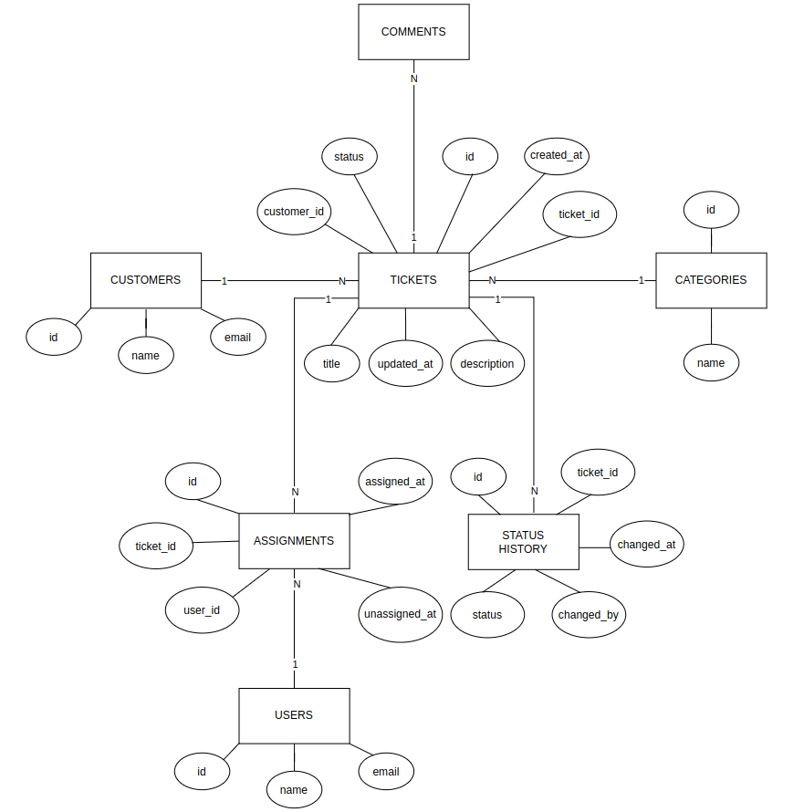

# Support Ticket Database

## Entities

- Users
- Customers
- Tickets
- Comments
- Categories
- Assignments
- Status History

## Relationships

- A customer can have many tickets.
- A category can contain many tickets.
- A ticket can have many comments.
- A ticket can have many assignments.
- A user can have many assignments.
- A ticket can have many status history records.
- A user can create many status history records.

## Assumptions

- Customers and support users are separate entities.
- Each ticket belongs to one customer.
- Each ticket belongs to one category.
- A ticket can have multiple comments.
- A ticket can have multiple assignments over time.
- Assignment history is retained.
- A ticket has one current status.
- Changes to ticket status are stored in status history.
- IDs are generated by PostgreSQL.
- Email addresses are unique for users and customers.

## ER Diagram

